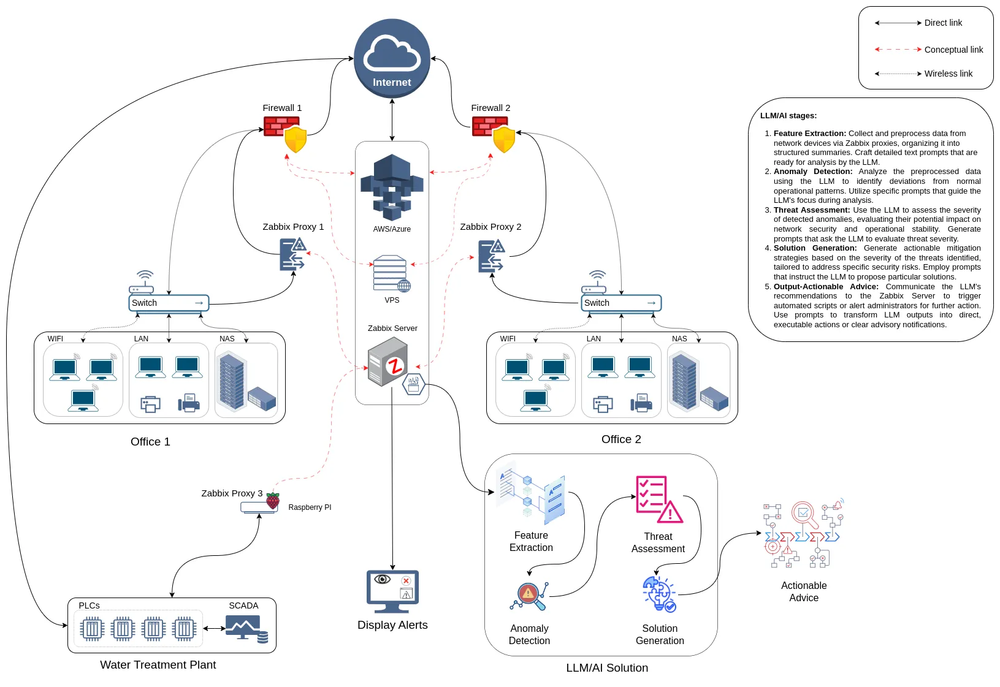

# Log Analysis and Anomaly Detection System

This repository contains the implementation of an integrated log analysis and anomaly detection system using Zabbix, Wazuh, and a large language model (LLM). The system is designed to collect, preprocess, and analyze logs from network devices and servers to detect potential security threats.

## System Overview

The system leverages Zabbix and Wazuh for log collection, Elasticsearch for log aggregation and storage, and advanced machine learning models for anomaly detection. It categorizes alerts into various severity levels and automates responses based on predefined criteria.

## Components

- **Zabbix**: Used for collecting network and server performance logs.
- **Wazuh**: Focuses on security monitoring, collecting logs from various endpoints.
- **Elasticsearch**: Aggregates and stores logs from Zabbix and Wazuh.
- **Logstash/Fluentd**: Used for preprocessing logs, including normalization and noise reduction.
- **TensorFlow/PyTorch**: Frameworks for training the machine learning model to detect anomalies.
- **Docker/Kubernetes**: For deploying the system components in a scalable and manageable way.
- **ELK Stack**: Used for real-time monitoring and visualization.
- **StackStorm/Rundeck**: Automation tools for handling alerts and responses based on severity.


## LLM/AI stages:
- **Feature Extraction**: Collect and preprocess data from network devices via Zabbix proxies, organizing it into structured summaries. Craft detailed text prompts that are ready for analysis by the LLM.
- **Anomaly Detection**: Analyze the preprocessed data using the LLM to identify deviations from standard operational patterns. Utilize specific prompts that guide the LLM's focus during analysis.
- **Threat Assessment**: Use the LLM to assess the severity of detected anomalies, evaluating their potential impact on network security and operational stability. Generate prompts that ask the LLM to evaluate threat severity.
- **Solution Generation**: Generate actionable mitigation strategies tailored to address specific security risks based on the severity of the threats identified. Employ prompts that instruct the LLM to propose particular solutions.
- **Output-Actionable Advice**: Communicate the LLM's recommendations to the Zabbix Server to trigger automated scripts or alert administrators for further action. Use prompts to transform LLM outputs into direct, executable actions or clear advisory notifications.


## Architecture

Below is the high-level architecture of the system:



```plaintext


+-------------------+       +---------------------+
|      Zabbix       |       |       Wazuh         |
|   Log Collector   |------>|   Log Collector     |
|  (Zabbix Agent)   |       |  (Wazuh Agent)      |
+-------------------+       +---------------------+
             |                      |
             v                      v
       +-------------+        +-------------+
       | Log Server  |------->| Log Server  |
       | (Storage)   |        | (Storage)   |
       |Elasticsearch|        |Elasticsearch|
       +------------*+        +-------------+
                |                   |
                v                   v
             +---------------------------+
             | Log Aggregation & Storage |
             |       (Elasticsearch)     |
             +---------------------------+
                         |
                         v
             +---------------------------+
             |   Preprocessing & Filter  |
             |---------------------------|
             | - Normalization           |
             | - Noise Reduction         |
             | - Feature Extraction      |
             |  Tools: Logstash, Fluentd |
             +---------------------------+
                         |
                         v
             +---------------------------+
             | Training Data Preparation |
             |---------------------------|
             | - Data Labeling           |
             | - Dataset Splitting       |
             |  Tools: Python, Pandas    |
             +---------------------------+
                         |
                         v
             +---------------------------+
             |      Model Training       |
             |    (Large Language Model) |
             |  Tools: TensorFlow, PyTorch|
             +---------------------------+
                         |
                         v
             +---------------------------+
             | Integration & Deployment  |
             | Tools: Docker, Kubernetes |
             +---------------------------+
                         |
                         v
             +-------------------------------------+
             |         Alerts & Response           |
             |-------------------------------------|
             | - Initial Detection                 |
             | - Alert Categorization              |
             |   + Low: Automated Logging          |
             |   + Medium: Automated Response      |
             |   + High: Manual Review             |
             |   + Critical: Immediate Escalation  |
             |Tools: ELK Stack, StackStorm, Rundeck|
             +-------------------------------------+
```
## Contributors

- [Hubert Homaei](https://github.com/homaei), [Oscar Mogollon](https://github.com/omogollo2), [Aagustin di Bartolo](https://github.com/Jacklamotta).
  
## License

This project is licensed under the MIT License - see the [LICENSE](LICENSE) file for details.
